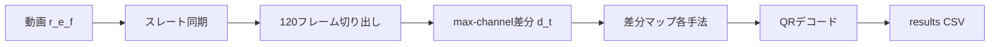

# 01. 解析パイプライン概要

不可視に埋め込んだ点滅 QR を、カメラ動画から復元するまでの流れを説明する。

## 全体フロー



1. **入力動画** `r{rate}_e{exp}_f{fluoro}.mp4` と表示マニフェストを読む
2. **黒→赤スレート**で時間同期を取る
3. 各条件ブロックの **2〜4秒** から連続 **120フレーム** を切り出す
4. 隣接フレームの **max-channel 差分** 系列 \(d(t)\) を1回作る
5. \(d(t)\) から **pair / accum / stat / lockin / fourier** などのマップを生成する
6. マップを **QRデコード**し、GT（`frame_QR.png`）との画素一致率も計算する
7. 条件ごとにスイープ結果を CSV に集約する

手法の詳細は [02_methods.md](02_methods.md)、条件と指標は [03_conditions_and_metrics.md](03_conditions_and_metrics.md)。

## 何を入力とするか

### 動画メタ（ファイル名）

| 記号 | 例 | 意味 |
|---|---|---|
| `rate` | 45 / 60 / 90 / 120 / 180 | 表示の点滅レート [Hz] |
| `exp` | 250 / 125 / 60 | 撮影露光（`e250` = 1/250 秒） |
| `fluoro` | 0 / 1 | 蛍光灯なし / あり |

例: `r60_e250_f1.mp4`

### 1動画あたりの条件（60ブロック）

表示側は次の直積で **60条件** を順に出す。

- **画像** 4種: `rice`, `nagaoka_fireworks`, `hocho`, `ex`
- **チャネル** 5種: `R`, `G`, `B`, `min`→フォルダ名 `I`, `max`→`X`
- **埋め込み強度** 3種: `4`, `8`, `12`

条件フォルダ例: `rice_R_4`, `ex_X_12`  
並びは **チャネル → 画像 → 強度**。

## 共通前処理

### 同期と切り出し

- 同期: 黒→赤スレート検出（`SyncConfig`）
- 切り出し: 各条件の **2秒目〜4秒目** から連続 **120枚**（`frame_00000.png` …）
- GT: 動画内の QR 表示区間から `frame_QR.png` を生成し、画素 accuracy に使う

### max-channel 差分 \(d(t)\)

全手法の共通入力は、RGB 正規化後の隣接フレーム差分である。

- 実装: `gpu_ops.max_channel_difference` → `hully_diff.build_pair_diff_stack`
- 各画素で変化が最も大きいチャネルを選び、他2チャネル平均を引いたスカラー差分
- 出力形状: \((T-1, H, W)\)（120フレームなら 119 枚分の差分系列）

現行の主経路 [`run_pipeline_hully.py`](../analyze_code/run_pipeline_hully.py) では、条件ごとにこの \(d(t)\) を **1回だけ** 作り、複数手法（pass）へ使い回す。

## 主スクリプトとプロファイル

| 役割 | スクリプト | 既定出力の目安 |
|---|---|---|
| 現行コア（1動画） | [`run_pipeline_hully.py`](../analyze_code/run_pipeline_hully.py) | `out_*/r*_e*_f*/` |
| 一括・主解析 | [`all_analyze_mid.py`](../analyze_code/all_analyze_mid.py) | `out_mid_MMDD/` |
| 一括・日常（軽い） | [`all_analyze_mid_fast.py`](../analyze_code/all_analyze_mid_fast.py) | `out_mid_fast_MMDD/` |
| 一括・厚い互換 | [`all_analyze_hard.py`](../analyze_code/all_analyze_hard.py) | `out_hard/` |
| 旧・単一モード | [`run_pipeline.py`](../analyze_code/run_pipeline.py) | `out/`（lockin なし） |

コマンドの具体例は [`../README.md`](../README.md) と [`../command.md`](../command.md) を参照。

### mid / mid_fast / hard の違い（要約）

いずれも hully パイプライン上で、**スイープの厚さと pass 構成**が違う。

| 項目 | mid（主） | mid_fast（日常） | hard（厚い） |
|---|---|---|---|
| フラグ | `--mid-sweeps` | `--mid-fast-sweeps` | `--hard-sweeps` |
| binary pass | pair, accum, stat_std, stat_var, lockin, fourier | 同左 | 同左 |
| gray (`*_num`) pass | accum_num, stat_std_num, lockin_num, fourier_num | 同左 | 同左 |
| pair の使うペア数 | 先頭+末尾 各20 | 各10 | 全隣接ペア |
| pair 閾値例 | 4,6,8,10,12 | 4,8,12 | 4,6,8,10 |
| lockin/fourier binary th | 旧 4〜16（th/255） | **p30/p50/p70 + Otsu + adaptive** | 旧 2〜16（th/255） |
| lockin 位相ステップ | 4,8,16 | 8 のみ | 4,8,16 |
| fourier band radius | 2 | 2 | 2 |
| 周波数候補 | hard 系（rate/2, /4 等＋折り畳み） | 同左 | 同左 |

`stat_var_num` は実績がほぼ無いため gray pass には入れていない。

## QRデコード探索の強さ

マップ生成後の読取探索も段階がある（詳細は README）。

| モード | 概要 |
|---|---|
| fast（既定） | gray × kernel5、ZXing 優先 |
| mid（`--mid-search`） | gray + median_otsu、kernel 3/5/7 |
| full（`--full-search`） | バリアント・拡大を最大まで広げる（遅い） |

`all_analyze_mid` は mid-search、日常の mid_fast は設定に応じて間引く。

### 不足スイープの追記（再実行せず穴埋め）

すでに回した `out_mid_fast_*` に、現行 mid_fast 定義で足りないスイープだけ足す場合は [`../analyze_code/re_analyze_mid_fast.py`](../analyze_code/re_analyze_mid_fast.py) を使う。既定は `fourier` / `lockin`（新 th の p30/p50/p70・Otsu・adaptive）。フレームは残っていない想定なので動画から再抽出し、既存 CSV 行は消さず追記して `adopted` を振り直す。

```bash
python R8/analyze_code/re_analyze_mid_fast.py --out-dir R8/analyze_code/out_mid_fast_0805 --dry-run
python R8/analyze_code/re_analyze_mid_fast.py --out-dir R8/analyze_code/out_mid_fast_0805
```


## スライド用の一文まとめ

表示レート・露光・蛍光灯を変えて撮った動画から、各埋め込み条件の120フレームを切り出し、max-channel 差分系列を共通入力として複数の時間解析マップを作り、QRが読めるかとGT一致率で評価している。
